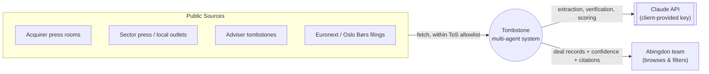
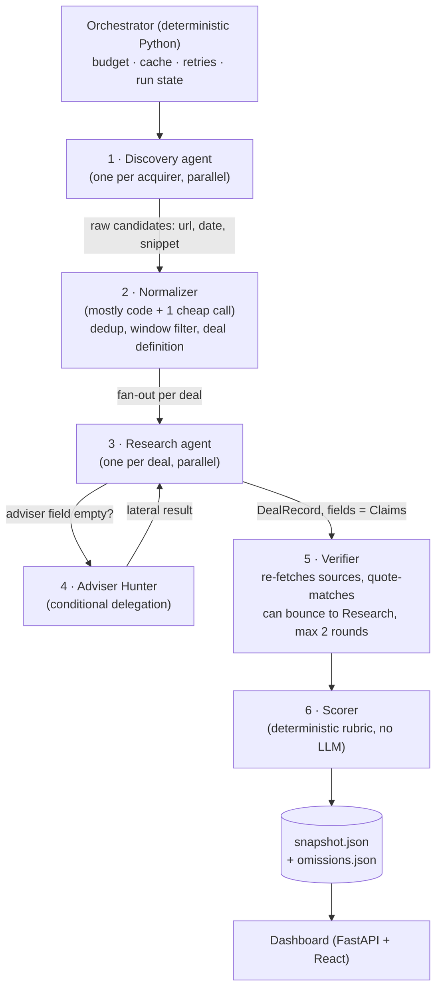

# Tombstone
### Competitor Acquisition Tracker — Project Proposal & Architecture

| | |
|---|---|
| **Client** | Abingdon Software Group |
| **Client contact** | Mario Bortolozzo — mario@abingdon.software |
| **Prepared by** | Angela Arroyo |
| **Context** | Technical case study — AI/Agent Engineer interview exercise |
| **Date** | August 2026 |
| **Status** | Proposed → In Progress |

---

## 1. Executive Summary

Abingdon Software Group acquires and operates vertical-market software businesses, competing for deals against other serial acquirers (Volaris, Valsoft, Everfield, Banyan, TSS/Topicus, Snowball, BSG). Today, Abingdon learns about competitors' acquisitions incidentally, through scattered press coverage. There is no systematic competitive intelligence process.

**Tombstone** is a multi-agent system that monitors named competitors, discovers acquisitions announced in a rolling window, researches each deal across primary and secondary sources, cross-verifies every extracted fact against its cited source, and publishes the result to a filterable dashboard.

The brief is explicit that the deliverable under evaluation is **agentic system design**, not data coverage: an orchestrated workflow where subagents delegate, hand off work, and check each other — not a single script that scrapes and calls a model once. This document proposes that architecture, states the reasoning behind each design decision, and defines what is deliberately out of scope.

The single hardest constraint in the brief — *"a fabricated value is an automatic fail; a well-handled 'undisclosed' is a pass"* — is treated as the organizing design principle, not an afterthought. It drives three structural choices: every extracted field is a **Claim** carrying its verbatim source quote, not a bare value; a dedicated **Verifier** agent re-fetches every cited source and checks the quote exists before a claim is accepted; and fields carry a **three-state status** (`verified` / `explicitly_undisclosed` / `not_found`), so "the price is not public" is captured as a positive fact rather than a null.

---

## 2. Client Brief

### 2.1 Background

> Abingdon Software Group acquires and operates vertical market software businesses. Other serial acquirers compete with us for the same deals. We have no systematic view of what they have bought recently — deals surface through press releases and news, and we only catch some of them.

### 2.2 The Ask

> Build an agentic system that finds the acquisitions announced in the last three months by the acquirers below, researches each one, and presents the results in a dashboard we can browse and filter. We are looking for an orchestrated workflow with subagents that delegate, hand off work and check each other — not a single linear script that scrapes and calls a model once. Beyond that, the architecture is yours to design. Framework, agent roles, tooling and structure are your call; tell us why you chose them.

### 2.3 Tracked Acquirers & Starting Sources

| Acquirer | Starting source | Note |
|---|---|---|
| Volaris Group | volarisgroup.com/press-room | |
| Valsoft | valsoftcorp.com/news | |
| Everfield | everfield.com/knowledge-platform/tag/news | |
| Hawk Infinity Software → **Snowball Software Group** | hawkinfinity.com, snowballsoftwaregroup.com | Renamed; Euronext / Oslo Børs filings are the primary source, not the corporate site |
| Banyan Software | news.banyansoftware.com | |
| TSS / Topicus | totalspecificsolutions.com/acquisitions, topicus.com/news | |
| Business Software Group (BSG) | bsg.site/noticias | Spanish-language source |

The client is explicit that these are **starting points, not the boundary** — the system is expected to range beyond them.

### 2.4 Required Fields per Deal

Acquirer · target name · date announced · what the target does · geography · **M&A adviser** (financial adviser only — not legal, tax, or technical due diligence; typically absent from the acquirer's own release) · purchase price · source links · a confidence indicator.

### 2.5 Constraints (as given)

1. **No fabrication.** Most prices are undisclosed. A fabricated value is an automatic fail; a well-handled "undisclosed" is a pass.
2. **Multilingual.** Some sources are in Spanish — BSG in particular.
3. **Respect ToS.** No scraping sources that prohibit it, LinkedIn included. If in doubt, leave it out and say so.
4. **Cost.** The client provides a Claude API key with prepaid credits. Use only that key.
5. **Scope is manageable.** Not measured on speed. If something has to give, cut data coverage before design — four acquirers done well beats seven done flat.

### 2.6 Deliverables (as given)

- The system and dashboard, runnable by the client.
- A private GitHub repository with a README.
- A short note on architecture and reasoning: what was built, what was cut, where it breaks.
- A 45-minute walkthrough call with a live run.

---

## 3. Problem Framing

Abingdon's problem is not a data-availability problem — competitor acquisitions are, almost by definition, public. It is a **process** problem: nobody owns the job of watching seven acquirers across two languages and multiple jurisdictions on a rolling basis, so intelligence arrives by chance.

That reframes the deliverable. The system is not a one-off scraper that produces a spreadsheet; it is a **standing intelligence process** — discovery, verification and confidence scoring as repeatable, auditable steps — that happens to be demoed as a single run. The architecture has to reflect that it *runs again next quarter*, not just that it produces today's answer.

It also reframes what "done" means for a field like M&A adviser or purchase price. These are frequently and legitimately unknowable from public sources. A system graded on cell-filling would be incentivized to guess. A system graded on **trustworthiness of what it asserts** is not — and the brief's grading criterion says explicitly that the second is what is being measured.

---

## 4. Scope Definitions

Two terms in the brief need a precise, working definition before they can be encoded in the Normalizer — stated here so the choice is explicit and reviewable rather than an implicit convention buried in code.

- **"Acquisition"**: a deal where the acquirer obtains majority control of a previously independent company, announced within the tracking window. Minority investments and mergers between two companies already owned by the same acquirer are excluded from the deal count and logged separately in `omissions.json`, not silently dropped — TSS/Topicus and Volaris both announce enough small, ambiguous deals that this line has to be drawn somewhere explicit.
- **"Last three months"**: a rolling window ending on the run date, configurable via a single constant rather than hardcoded, so the same run definition holds whether it's executed today or during the walkthrough call.

Persistence is treated as core architecture, not an add-on: the system supports both a live `docker compose up` run against the client's key and a committed, documented snapshot for instant inspection — see Section 6.5 and Section 10.

---

## 5. Proposed Solution — Approach Overview

Tombstone is built as a **pipeline of specialized, cooperating agents** orchestrated by deterministic Python, following a discovery → normalize → research → verify → score flow. The guiding split of responsibility:

- **Code owns bookkeeping, gating and arithmetic** — deduplication, the compliance allowlist, the confidence rubric, caching, cost tracking. Nothing that has one correct, checkable answer is left to an LLM to "decide."
- **Agents own judgment** — reading a press release in Spanish and extracting what the target does, deciding whether a claim needs a second, lateral search, deciding whether a quote actually supports the value it's attached to.
- **No agent's output is trusted by default.** Every fact-bearing agent output is treated as a claim to be checked, not a fact to be stored — this is what makes the system "orchestrated" rather than "linear": a downstream agent's job is explicitly to interrogate an upstream agent's work, and it can send work back.

---

## 6. Architecture

### 6.1 System Context (C4 Level 1)



### 6.2 Agent Roster & Orchestration (C4 Level 2)



**1 · Discovery** (one instance per acquirer, run in parallel). Each instance receives a declarative source profile — allowed domains, language, source type. Snowball's profile points at Oslo Børs / Euronext filings, not the corporate site, per the client's own note. BSG's profile is read in Spanish, unmodified. Discovery's output is *candidates*, never deals — url, date, snippet. It does not interpret.

**2 · Normalizer.** Largely deterministic code. Collapses duplicates into a canonical `deal_id`, applies the window filter, and applies the acquisition definition from Section 4 — encoded as config, not prompt text, so it's testable and auditable.

**3 · Research** (one instance per deal, parallel). Extracts what the target does, geography, and price. This is where the core data primitive is enforced: **no field is a string.** Every field is a `Claim` — see 6.3. A validation hook rejects any agent output where a value has no accompanying verbatim quote; this is a structural gate, not a prompt instruction.

**4 · Adviser Hunter.** A specialist subagent, invoked **only when Research leaves the adviser field empty** — the brief notes this field is "often absent from the acquirer's own release." This conditionality is the clearest demonstration of real delegation in the system: different search strategy (advisory-side, not acquirer-side sources — tombstones, sector press, the target's own release in its local language), different budget, different failure mode than the agent that triggered it.

**5 · Verifier.** Receives the `DealRecord` and trusts none of it. For every claim, it re-fetches the cited URL and checks the verbatim quote appears in the page content via literal substring match — deterministic, not model-graded, and not gameable by a plausible-sounding hallucination, because a hallucinated quote does not exist on any real page. A claim that fails the check is downgraded to `not_found`, not silently kept. The Verifier also flags single-sourced claims and conflicting values across sources — **conflicts are surfaced, never silently resolved.** It can bounce a `DealRecord` back to Research, capped at two rounds to bound cost.

**6 · Scorer.** A deterministic rubric — never an LLM-produced number. Inputs: source tier (primary filing/press release = 1.0 → aggregator = 0.4), count of independent corroborating domains, Verifier quote-match outcome, field completeness.

### 6.3 Data Model — the Claim Primitive

```json
{
  "field": "purchase_price",
  "status": "explicitly_undisclosed",
  "value": null,
  "source_url": "https://...",
  "verbatim_quote": "financial terms of the transaction were not disclosed",
  "source_language": "en",
  "extracted_at": "2026-08-15T10:03:00Z",
  "verified": true
}
```

`status` is one of three values, not two:

| Status | Meaning | Example |
|---|---|---|
| `verified` | A value was extracted and the Verifier confirmed the quote supports it | `"price": "$14M", quote: "...for approximately $14 million"` |
| `explicitly_undisclosed` | The source explicitly states the fact is not being disclosed | `quote: "terms were not disclosed"` |
| `not_found` | No source addresses the field, or a claimed value failed verification | *(no quote)* |

This is the direct implementation of the brief's grading line: an `explicitly_undisclosed` price is a **first-class, correctly-handled outcome**, not a gap.

### 6.4 Confidence Scoring

Computed by the Scorer, never asserted by an agent:

```
confidence = w1 · source_tier + w2 · corroboration_count + w3 · verifier_pass_rate + w4 · field_completeness
```

Weights and tiers live in a single config file, not scattered across prompts — so the rubric itself is reviewable in code review, independent of any model's behavior.

### 6.5 Compliance Gate

`sources/allowlist.yaml` is checked **before any fetch**, at the network layer, not by prompt instruction:

```yaml
- domain: linkedin.com
  allowed: false
  reason: "ToS prohibits scraping"
- domain: mergermarket.com
  allowed: false
  reason: "Paywalled, restrictive ToS"
- domain: news.banyansoftware.com
  allowed: true
  reason: "Public press room, no scraping prohibition found"
```

Every blocked domain a Discovery agent would otherwise have used is logged to `omissions.json` with a reason, and rendered as its own tab in the dashboard — turning "if in doubt, leave it out and say so" into a UI artifact the client can inspect, not a line buried in a README.

---

## 7. Key Design Decisions

| Decision | Why |
|---|---|
| **Claude Agent SDK over LangGraph** | The workflow is a bounded fan-out/fan-in with one conditional loop (Verifier ↔ Research) — not a complex stateful graph. The SDK gives subagents, validation hooks, and built-in web search/fetch tools billed directly against the client's provided key, without an abstraction layer that would need its own justification. |
| **Deterministic orchestrator, not an agent, for control flow** | Budget limits, caching keys, retry counts and run state have single correct answers. Delegating them to an LLM adds cost and non-determinism with no upside. |
| **Claim, not string, as the atomic data type** | The brief's automatic-fail condition is fabrication. A bare string can't be checked for provenance; a Claim with a mandatory verbatim quote can be — and is, by the Verifier. |
| **Verifier re-fetches and does literal quote matching, not a second model opinion** | A second LLM call can hallucinate agreement with the first. A substring match against a freshly fetched page cannot — the quote either exists on a real page or it doesn't. |
| **Three-state field status, not boolean present/absent** | Collapses the client's explicit grading distinction ("fabricated = fail, well-handled undisclosed = pass") directly into the schema, instead of leaving it as an implicit convention an agent might not follow consistently. |
| **Adviser Hunter is conditionally invoked, not always run** | Demonstrates real delegation — a distinct agent with a distinct strategy is handed the problem specifically because the general-purpose agent's own approach didn't work, not run in parallel by default for every deal regardless of need. |
| **Confidence score computed by a rubric, not asked of an LLM** | An LLM-reported confidence number is itself an unverified claim. A deterministic function of Verifier outcomes is auditable and reproducible from the same inputs. |
| **Compliance allowlist enforced at the fetch layer** | A prompt instruction ("don't scrape LinkedIn") is a suggestion a model can ignore under pressure to find data. A network-layer gate cannot be talked past. |
| **Per-(agent, input-hash) caching in SQLite** | Keeps repeat runs cheap against the client's prepaid key, and makes the two-round Verifier↔Research loop cost-bounded rather than open-ended. |
| **Committed, documented data snapshot** | Lets the client evaluate output quality (the thing they're actually grading) by opening the dashboard, without spending their key or waiting ~10–15 minutes for a live run first. |
| **Quotes stored verbatim in source language, translated separately** | Translating before extraction would break quote-grounding — the Verifier needs to match against the actual page text, not a paraphrase. |

---

## 8. Scope: What I Am Not Building, and Why

- **Not scraping Mergermarket**, despite it being the obvious source for adviser data. It's paywalled with a restrictive ToS; the brief explicitly rewards documenting an omission over quietly working around one.
- **Not attempting all seven acquirers up front.** The brief states this directly — coverage cut before design cut. See Section 9.
- **Not building automatic conflict resolution** when two sources disagree on a value (e.g. two different reported prices). The Verifier surfaces the conflict; resolving it silently would reintroduce exactly the fabrication risk the design exists to prevent.
- **Not fine-tuning or using a second model provider.** The brief restricts spend to the provided Claude key; a second provider would also need separate justification for zero benefit here.
- **Not building real-time/streaming monitoring.** Competitor acquisitions are announced, not ticking data — a scheduled or on-demand batch run covers the actual need. Continuous polling would add infrastructure cost against a use case that doesn't require it.
- **Not translating source documents wholesale.** Only the fields being extracted are translated for display; full-document translation adds cost and a second place for meaning to drift from the verbatim quote.

---

## 9. Coverage Plan

Five acquirers, chosen so each stresses a different part of the design rather than being five instances of the same case:

| Acquirer | What it stress-tests |
|---|---|
| Volaris Group | High volume, clean press room — the baseline case |
| Banyan Software | Clean US/CA feed, second data point against the baseline |
| Business Software Group (BSG) | Spanish-language pipeline, non-English quote grounding |
| Snowball Software Group (ex-Hawk Infinity) | Regulatory filings (Euronext/Oslo Børs) instead of a corporate press page |
| TSS / Topicus | High volume and the sharpest edge cases for "what counts as an acquisition" (Section 4) |

Everfield and Valsoft are the first to be added if time allows beyond the five — deliberately deferred, not forgotten.

---

## 10. Deliverables & Definition of Done

| Deliverable | Definition of done |
|---|---|
| System + dashboard | `docker compose up` runs the full pipeline against the client's key and serves the dashboard locally; no other setup required |
| Private GitHub repository + README | Repo includes a committed reference snapshot, quick start, and architecture summary |
| Architecture & reasoning note | This document (or a trimmed version of it) — what was built, what was cut, where it breaks |
| 45-minute walkthrough | Live run of one acquirer (~2 min, known cost) demonstrated alongside the full cached snapshot; includes at least one example of the Verifier rejecting a claim |

---

## 11. Risks & Where It Breaks

- **Adviser field will still be frequently empty.** Even with lateral search, this is genuinely hard information; the system should fail to `not_found` cleanly rather than guess, and it's expected to show up empty on the dashboard more often than any other field.
- **Single-source claims.** Some legitimate facts (especially from smaller acquirers) will only ever appear in one place. These are marked with lower confidence, not discarded — but the client should expect to see them.
- **Site structure changes.** If an acquirer changes their press room layout mid-project, Discovery for that acquirer degrades to zero new candidates rather than failing loudly. Detecting a silent zero-yield run is a known gap, mitigated by a minimum-candidate-count check per run, not solved outright.
- **Non-English sources beyond Spanish.** The multilingual handling is validated against BSG (Spanish). If Discovery encounters other languages incidentally, extraction quality is unverified.
- **Verifier false negatives.** Legitimate paraphrased reporting (a claim technically true but not a literal substring of any single page) will be marked `not_found` rather than `verified`. This is a deliberate bias toward under-claiming over the alternative of a looser match that risks a false positive.
- **Cost ceiling.** The Adviser Hunter's lateral search and the two-round Verifier loop are the main cost drivers; both are hard-capped, so under budget pressure the system degrades to more `not_found` fields rather than exceeding spend.

---

## 12. Repository Structure (Appendix)

A single private repository. The root itself *is* the backend — `src/` is a flat, plain package (no nested `src/tombstone/` or `backend/` folder), matching the convention used across the author's other production repos: not pip-installed, imported directly as `from src.domain... `. `frontend/` is the one subfolder that sits outside `src/`. No second repository: that would mean two clones and manual wiring for the client, against a brief that asks for one repository, runnable with one command.

```
tombstone/
├── README.md                    (quick start, runnable by the client)
├── CLAUDE.md                    (project constitution — directory rationale, NEVER-do list)
├── docker-compose.yml           (local full stack — API + frontend, live run)
├── requirements.txt
├── requirements-dev.txt
├── pyproject.toml               (tool config only — ruff/mypy/pytest, no packaging)
├── docs/
│   ├── PROJECT_PROPOSAL.md      (this document)
│   └── ARCHITECTURE_NOTE.html   (trimmed architecture & reasoning note)
│
├── src/
│   ├── config.py                (pydantic-settings — the only place env vars are read)
│   ├── domain/                  (pure logic, no framework imports)
│   │   ├── models.py            (Claim, DealRecord, AcquirerProfile)
│   │   ├── scoring.py           (confidence rubric, pure function)
│   │   └── deal_definition.py
│   ├── agents/
│   │   ├── discovery.py
│   │   ├── normalizer.py
│   │   ├── research.py
│   │   ├── adviser_hunter.py
│   │   ├── verifier.py
│   │   └── scorer.py
│   ├── orchestrator/
│   │   ├── run.py
│   │   ├── cache.py             (SQLite, per agent+input hash)
│   │   └── budget.py
│   ├── api/                     (FastAPI — thin, no business logic)
│   └── utils/
│       └── fetch.py             (the only place a network request may originate)
│
├── sources/
│   ├── allowlist.yaml           (ToS gate, enforced by utils/fetch.py)
│   └── profiles/                (one YAML per acquirer)
│
├── tests/
│   ├── unit/
│   └── integration/
│
├── frontend/                    (React + Vite + Tailwind — static build for public deploy)
│
└── data/
    ├── snapshot_2026-08-15.json (committed reference output)
    └── omissions.json
```

### Deployment: two modes, same codebase

- **Local, live:** `docker compose up` runs the full API (agent pipeline + FastAPI) and frontend together, against the key in `.env`. This is what's demoed live in the walkthrough call.
- **Public, static:** the frontend is deployed as a static build reading `data/snapshot_*.json` and `data/omissions.json` directly, no API involved. This is deliberate, not a shortcut: a publicly reachable API that can trigger the pipeline would let anyone who finds the link spend the client's prepaid credits. The static deployment removes that surface entirely. Planned host: Vercel or Netlify free tier, on a subdomain of the author's own domain — last item on the build list, a bonus on top of the required deliverable rather than a substitute for it.

---

## 13. 30-Second Pitch

"Tombstone is a multi-agent competitive intelligence system for Abingdon Software Group. It tracks named competitor acquirers, discovers acquisitions announced in a rolling window, and researches each deal through a pipeline where a Research agent extracts fields as source-grounded claims, a conditionally-invoked Adviser Hunter runs lateral searches for the financial adviser when it's missing, and a Verifier re-fetches every cited source to confirm quotes actually support the claimed values before anything is scored or published. Every field carries a three-state status — verified, explicitly undisclosed, or not found — so a well-handled 'undisclosed' is captured as a fact, not left as a gap a model might be tempted to fill in. The result is a filterable dashboard, backed by a compliance gate that blocks disallowed sources like LinkedIn at the network layer and logs every omission for review."
